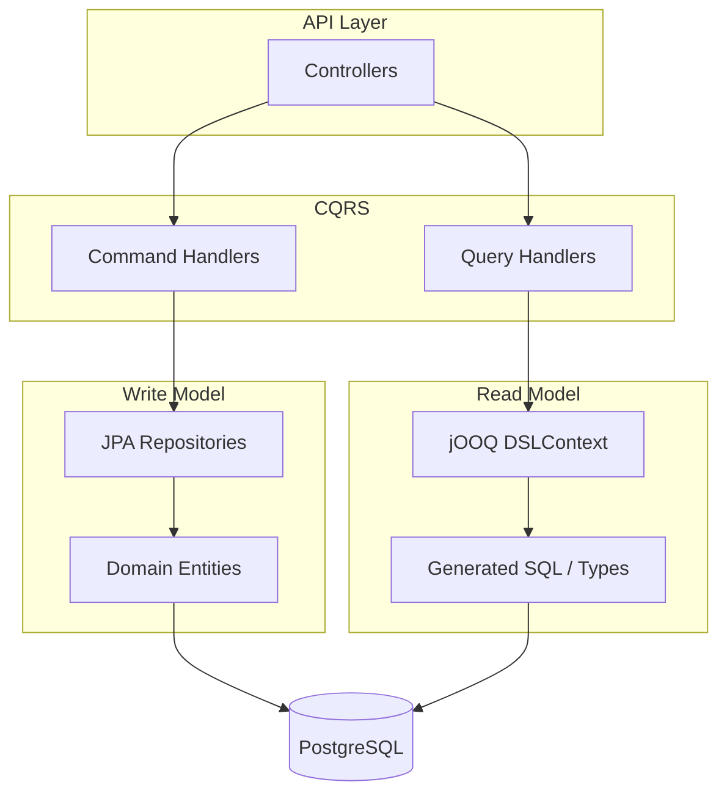

# Implementation Plan: Missing Backend Functionality and Logic

Scope is limited to **backend API and application logic** from [docs/BACKEND_GAP_ANALYSIS.md](docs/BACKEND_GAP_ANALYSIS.md). Out of scope: table-prefix migration (sys_, pay_, hotel_), module isolation, Kafka/Redis wiring, and frontend.

---

## CQRS: Commands (Spring JPA) and Queries (jOOQ)

The project adopts **CQRS** (Command Query Responsibility Segregation): **commands** (writes) use **Spring Data JPA** and domain entities; **queries** (reads) use **jOOQ** for type-safe SQL and better read performance (projections, joins, no N+1).

### Responsibilities

| Side        | Technology      | Use for                                                                                                                                                                                                                                                                                     |
| ----------- | --------------- | ------------------------------------------------------------------------------------------------------------------------------------------------------------------------------------------------------------------------------------------------------------------------------------------- |
| **Command** | Spring Data JPA | Create, update, delete; state changes; validation and domain logic; existing [UserRepository](backend/src/main/java/com/ziyara/backend/domain/repository/UserRepository.java), [BookingRepository](backend/src/main/java/com/ziyara/backend/domain/repository/BookingRepository.java), etc. |
| **Query**   | jOOQ            | All GET/list operations; dashboards; reports; search; read-only DTOs and projections. No entity load for read-only use cases.                                                                                                                                                               |

### High-level flow

### Package structure (add under existing packages)

- **Commands**: `application.command` (or `application.service.command`) – command handlers that use existing JPA repositories and domain entities. Controllers call these for POST/PUT/PATCH/DELETE.
- **Queries**: `application.query` (or `infrastructure/query`) – query handlers that use jOOQ `DSLContext` to build and execute SELECTs, returning DTOs. Controllers call these for GET.
- **jOOQ generated code**: `target/generated-sources/jooq` (or a dedicated package like `com.ziyara.backend.infrastructure.jooq`) – tables, records, and types generated from the PostgreSQL schema. Do not commit generated code if generated at build time; commit only if schema is stable and generation is manual.

### jOOQ setup

1. **Dependency** in [backend/pom.xml](backend/pom.xml):
  - Add `org.jooq:jooq` and `org.jooq:jooq-meta` (version aligned with Spring Boot / BOM, e.g. 3.18.x).
  - Add `org.jooq:jooq-codegen-maven` (or use `jooq-codegen-spring` if preferred) for code generation.
2. **Code generation** (Maven plugin):
  - Configure `jooq-codegen-maven` to connect to PostgreSQL (use same URL/user as app or a build profile).
  - Input: existing schema (run migrations before generate, or point to schema.sql).
  - Output: Java classes into `target/generated-sources/jooq`; package e.g. `com.ziyara.backend.infrastructure.jooq.ziyarah` (catalog/schema name from DB).
  - Generate on `generate-sources` phase so builds stay reproducible.
3. **Runtime**:
  - Create a `@Configuration` bean that builds `DSLContext` from the application `DataSource` (e.g. `DSL.using(dataSource, SQLDialect.POSTGRES)`).
  - Inject `DSLContext` into query handlers only; command handlers stay with JPA only.
4. **Usage in query handlers**:
  - Use generated tables (e.g. `USERS`, `BOOKINGS`) and build type-safe SELECTs with joins and filters.
  - Map `Record` or typed record to response DTOs (manual mapping or small mapper methods); avoid loading JPA entities for read paths.
  - List endpoints: use jOOQ for pagination (`.limit()`, `.offset()`) and filtering; return page of DTOs.

### Mapping phases to CQRS

- **Phase 1 (Auth, Users)**: Register/login/password/OTP = commands (JPA). GET /users, GET /users/{id}, GET /users/{id}/login-history = queries (jOOQ).
- **Phase 2 (Complaints, Discounts, Services, Refunds)**: All POST/PUT/DELETE and state transitions = commands (JPA). All GET/list/search = queries (jOOQ).
- **Phase 3 (Providers, Bookings, Reviews, Notifications, Exchange rates)**: Same rule – writes via JPA, reads via jOOQ. GET /providers (with filters), GET /bookings, GET /reviews, GET /notifications, GET /currency/rates = jOOQ.
- **Phase 4 (Dashboard, Reports)**: Pure reads – implement entirely with jOOQ (aggregations, group by, date ranges) for best performance.

### Migration strategy

- **Existing endpoints**: Leave as-is until touched. When adding or refactoring a GET, implement the read path with jOOQ and a query handler; keep existing command paths on JPA.
- **New endpoints**: Implement from the start with CQRS – command handler (JPA) for writes, query handler (jOOQ) for reads.

---

## Phase 1: Authentication and User Management

**CQRS:** All auth and user write operations (register, password/OTP, user CRUD, freeze, reset-password) = **commands (JPA)**. GET /users, GET /users/{id}, GET /users/{id}/login-history = **queries (jOOQ)**.

### 1.1 Auth extensions ([AuthController](backend/src/main/java/com/ziyara/backend/presentation/controller/AuthController.java), [AuthService](backend/src/main/java/com/ziyara/backend/application/service/AuthService.java))

- **POST /auth/register**: Request DTO (email, password, phone, role for customer); validate email uniqueness; hash password; create User (and Customer if role=CUSTOMER); assign default role; return success or 201. Reuse existing [UserRepository](backend/src/main/java/com/ziyara/backend/domain/repository/UserRepository.java), [Customer](backend/src/main/java/com/ziyara/backend/domain/entity/) if present). **Command (JPA)**.
- **POST /auth/password/forgot**: Request (email); if user exists, generate short-lived token (e.g. store in DB or Redis), trigger email (stub or optional integration); return generic success.
- **POST /auth/password/reset**: Request (token, newPassword); validate token; update password hash; invalidate token.
- **POST /auth/otp/send** and **POST /auth/otp/verify**: Request (email or phone); store OTP with expiry (new table or Redis); verify endpoint checks OTP and optionally issues temp token or marks verified. OTP delivery can be stub (log only) unless an email/SMS bean exists.

Security: [SecurityConfig](backend/src/main/java/com/ziyara/backend/infrastructure/config/SecurityConfig.java) already permits `/auth/register`, `/auth/otp/`**, `/auth/password/`**.

### 1.2 User management (new UserController, new or extended UserService)

- **GET /users**: Paginated list (page, size, optional status, role); Admin/Super Admin only; use [UserRepository](backend/src/main/java/com/ziyara/backend/domain/repository/UserRepository.java) `findAll`, `findByStatus`, `findByRole`; return DTOs (no password).
- **POST /users**: Create user (Admin/HR); validate email/phone uniqueness; hash password; set status PENDING_VERIFICATION or ACTIVE; assign role.
- **GET /users/{id}**: Get one user (by id); enforce role (Admin or self).
- **PUT /users/{id}**: Update profile fields (email, phone, status); do not expose password update here (use password/reset).
- **DELETE /users/{id}**: Soft-delete (set status DELETED or set deleted_at if present).
- **POST /users/{id}/freeze** and **POST /users/{id}/unfreeze**: Set status FROZEN / ACTIVE.
- **POST /users/{id}/reset-password**: Admin-only; body (newPassword); hash and set password.
- **GET /users/{id}/login-history**: Return list of sessions or audit entries for login actions; requires either sessions table or audit_logs filtered by action type (e.g. "LOGIN"). If no data source exists, add minimal persistence (e.g. last_login_at, last_login_ip on users plus optional login_events table) and populate from [AuthService](backend/src/main/java/com/ziyara/backend/application/service/AuthService.java) on login.

New DTOs: RegisterRequest, ForgotPasswordRequest, ResetPasswordRequest, OtpSendRequest, OtpVerifyRequest; reuse or extend UserResponse for user CRUD.

---

## Phase 2: Core Business APIs

**CQRS:** All POST/PUT/DELETE and state transitions = **commands (JPA)**. All GET/list = **queries (jOOQ)**.

### 2.1 Complaints full lifecycle ([ComplaintController](backend/src/main/java/com/ziyara/backend/presentation/controller/ComplaintController.java), new ComplaintService)

[ComplaintRepository](backend/src/main/java/com/ziyara/backend/domain/repository/ComplaintRepository.java) and [Complaint](backend/src/main/java/com/ziyara/backend/domain/entity/Complaint.java) already support status transitions (assign, resolve, escalate, close). Add:

- **Commands (JPA)**: ComplaintService create, update, assign, resolve, escalate, close; generate ticket number on create; use existing repository methods.
- **Queries (jOOQ)**: GET /complaints (list with filters: status, priority, customerId, assignedTo; paginated); GET /complaints/{id} (single complaint). Query handlers use jOOQ on complaints table (and joins for assignee/customer if needed); return ComplaintResponse DTOs.
- **ComplaintController**: GET /complaints, GET /complaints/{id} → query handlers; POST /complaints, PUT /complaints/{id}, POST .../assign, .../resolve, .../escalate, .../close → command handlers. Keep existing comment endpoints (commands for write, jOOQ for GET comment list if added).

DTOs: CreateComplaintRequest, UpdateComplaintRequest, ComplaintResponse; AssignComplaintRequest, ResolveComplaintRequest, etc.

### 2.2 Discounts CRUD and workflows ([DiscountController](backend/src/main/java/com/ziyara/backend/presentation/controller/DiscountController.java), [DiscountCodeService](backend/src/main/java/com/ziyara/backend/application/service/DiscountCodeService.java))

[DiscountCodeRepository](backend/src/main/java/com/ziyara/backend/domain/repository/DiscountCodeRepository.java) has save, findById, findByCode, findAll, deleteById.

- **Commands (JPA)**: POST /discounts (create; createdBy from JWT); PUT /discounts/{id}; DELETE /discounts/{id}; POST /discounts/{id}/approve, POST /discounts/{id}/deactivate; POST /discounts/apply (validate and optionally attach to booking). Use DiscountCodeService + JPA repositories.
- **Queries (jOOQ)**: GET /discounts (list with status filter, paginated); GET /discounts/{id}. Query handlers use jOOQ on discount_codes table; return DiscountResponse DTOs.

DTOs: CreateDiscountRequest, UpdateDiscountRequest, DiscountResponse; ApplyDiscountRequest/Response.

### 2.3 Services CRUD and search (new ServiceController, new or extended ServiceService)

[ServiceRepository](backend/src/main/java/com/ziyara/backend/domain/repository/ServiceRepository.java) already has findAll, findByProviderId, findByType, findByNameContaining, findByCity, etc.

- **Commands (JPA)**: POST /services (create; provider must exist); PUT /services/{id}; DELETE /services/{id}; POST /services/{id}/images; DELETE /services/{id}/images/{imageId}. Use ServiceRepository and ServiceImageRepository.
- **Queries (jOOQ)**: GET /services (list with filters providerId, type, status, city, country; paginated); GET /services/search (q, type, city, minPrice, maxPrice); GET /services/{id}; GET /services/{id}/availability (dates/rooms; can use jOOQ + subquery or keep small JPA call for conflict check). Query handlers use jOOQ on services (and service_images for images); return ServiceResponse DTOs.

DTOs: ServiceResponse, CreateServiceRequest, UpdateServiceRequest; ServiceImageRequest/Response.

### 2.4 Refunds ([PaymentController](backend/src/main/java/com/ziyara/backend/presentation/controller/PaymentController.java), RefundService or extend PaymentService)

[RefundRepository](backend/src/main/java/com/ziyara/backend/domain/repository/RefundRepository.java) exists.

- **Command (JPA)**: POST /payments/{id}/refund (amount, reason); validate payment COMPLETED and refundable; create Refund; update payment/booking state. PaymentService or RefundService + JPA only. Any GET refund list (if added) = **query (jOOQ)**.

DTOs: RefundRequest (amount, reason), RefundResponse.

---

## Phase 3: Extensions to Existing Modules

**CQRS:** Writes = **commands (JPA)**; GET/list = **queries (jOOQ)**.

### 3.1 Service providers ([ServiceProviderController](backend/src/main/java/com/ziyara/backend/presentation/controller/ServiceProviderController.java), [ServiceProviderService](backend/src/main/java/com/ziyara/backend/application/service/ServiceProviderService.java))

- **Commands (JPA)**: DELETE /providers/{id} (soft-delete); POST /providers/{id}/approve; POST /providers/{id}/suspend. Use ServiceProviderService + JPA.
- **Queries (jOOQ)**: GET /providers with query params (status, type/vertical); list paginated. Query handler uses jOOQ on service_providers; return provider DTOs.

### 3.2 Bookings ([BookingController](backend/src/main/java/com/ziyara/backend/presentation/controller/BookingController.java))

- **Commands (JPA)**: PUT /bookings/{id}; POST /bookings/{id}/confirm; POST /bookings/{id}/taxi (create TaxiBooking linked to booking). Use BookingRepository, TaxiBookingService + JPA.
- **Queries (jOOQ)**: GET /bookings (list with filters; already or refactor to jOOQ); GET /bookings/{id}/voucher (voucher shape: reference, dates, service name, customer, amount). Voucher = read-only → jOOQ query handler.

### 3.3 Reviews ([ReviewController](backend/src/main/java/com/ziyara/backend/presentation/controller/ReviewController.java), [ReviewService](backend/src/main/java/com/ziyara/backend/application/service/ReviewService.java))

- **Commands (JPA)**: PUT /reviews/{id}; DELETE /reviews/{id}; POST /reviews/{id}/moderate. Use ReviewService + JPA.
- **Queries (jOOQ)**: GET /reviews (list with serviceId, status; paginated); GET /reviews/{id}. Query handlers use jOOQ on reviews; return ReviewResponse DTOs.

### 3.4 Notifications ([NotificationController](backend/src/main/java/com/ziyara/backend/presentation/controller/NotificationController.java), [NotificationService](backend/src/main/java/com/ziyara/backend/application/service/NotificationService.java))

- **Command (JPA)**: POST /notifications/read-all (mark all as read for current user); add NotificationRepository method and call from service.
- **Query (jOOQ)**: GET /notifications/{id} (one by id; enforce ownership in handler). GET /notifications list (if present) = jOOQ. Align response DTO with entity (content vs message) if inconsistent.

### 3.5 Exchange rates ([CurrencyController](backend/src/main/java/com/ziyara/backend/presentation/controller/CurrencyController.java) or new ExchangeRateController, [CurrencyService](backend/src/main/java/com/ziyara/backend/application/service/CurrencyService.java))

- **Commands (JPA)**: POST /currency/rates (create); PUT /currency/rates/{id} (update). Use [ExchangeRateRepository](backend/src/main/java/com/ziyara/backend/domain/repository/ExchangeRateRepository.java) and CurrencyService. Any GET list/current rates = **query (jOOQ)**.

---

## Phase 4: Dashboard and Reporting

**CQRS:** All dashboard and report endpoints are **read-only → implement with jOOQ** (aggregations, GROUP BY, date ranges) for best performance. No command handlers for Phase 4.

### 4.1 Dashboard extensions ([DashboardController](backend/src/main/java/com/ziyara/backend/presentation/controller/DashboardController.java), [DashboardService](backend/src/main/java/com/ziyara/backend/application/service/DashboardService.java))

- **Queries (jOOQ only)**: **GET /dashboard/service-health** (counts per vertical: hotels, taxis, restaurants; optional active bookings per type); **GET /dashboard/commission-analysis** (aggregate base vs commission in date range); **GET /dashboard/payouts** (provider payouts in period). Implement via query handlers using jOOQ on services, payments, bookings; return ServiceHealthResponse, CommissionAnalysisResponse, PayoutSummaryResponse. Optional: group-specific KPIs filtered by role/group.

### 4.2 Reports ([ReportController](backend/src/main/java/com/ziyara/backend/presentation/controller/ReportController.java))

- **Queries (jOOQ only)**: **GET /reports/revenue** and **GET /reports/bookings** (start, end params); return JSON (totals, by day/period). Query handlers use jOOQ aggregations; Excel/PDF can be frontend or added later.

---

## Implementation order and dependencies

```mermaid
flowchart LR
  subgraph phase1 [Phase 1]
    Auth[Auth endpoints]
    UserMgmt[User Controller]
  end
  subgraph phase2 [Phase 2]
    Complaints[ComplaintService]
    Discounts[Discount CRUD]
    Services[ServiceController]
    Refunds[Refund endpoint]
  end
  subgraph phase3 [Phase 3]
    Providers[Provider approve/suspend]
    Bookings[Booking confirm/voucher/taxi]
    Reviews[Review CRUD/moderate]
    Notif[Notifications read-all]
    Rates[Exchange rate admin]
  end
  subgraph phase4 [Phase 4]
    Dashboard[Dashboard extensions]
    Reports[Report data]
  end
  phase1 --> phase2
  phase2 --> phase3
  phase3 --> phase4
```

- Phase 1 unblocks user management and auth flows used elsewhere.
- Phase 2 delivers the largest gap: complaints, discounts, services, refunds.
- Phase 3 extends existing controllers with minimal new services.
- Phase 4 adds dashboard and report data endpoints.

---

## Files to add or touch (summary)

| Area            | New files                                                                                                                                                                                                        | Files to extend                                                     |
| --------------- | ---------------------------------------------------------------------------------------------------------------------------------------------------------------------------------------------------------------- | ------------------------------------------------------------------- |
| **CQRS / jOOQ** | JooqConfig (DSLContext bean), `application.command` and `application.query` packages; query handlers per entity (e.g. UserQueryHandler, ComplaintQueryHandler); jOOQ codegen output (e.g. `infrastructure/jooq`) | backend/pom.xml (jOOQ deps + codegen plugin), DataSource config     |
| Auth            | RegisterRequest, ForgotPasswordRequest, ResetPasswordRequest, OtpSendRequest, OtpVerifyRequest                                                                                                                   | AuthController, AuthService                                         |
| Users           | UserController, CreateUserRequest, UpdateUserRequest; optional LoginHistoryResponse                                                                                                                              | UserService (new), UserRepository (existing)                        |
| Complaints      | ComplaintService, CreateComplaintRequest, UpdateComplaintRequest, ComplaintResponse, Assign/Resolve/Escalate/Close requests                                                                                      | ComplaintController                                                 |
| Discounts       | CreateDiscountRequest, UpdateDiscountRequest, DiscountResponse, ApplyDiscountRequest/Response                                                                                                                    | DiscountController, DiscountCodeService                             |
| Services        | ServiceController, ServiceService (if not exists), CreateServiceRequest, UpdateServiceRequest, ServiceResponse, availability/voucher DTOs                                                                        | ServiceRepository (existing)                                        |
| Refunds         | RefundRequest, RefundResponse                                                                                                                                                                                    | PaymentController, PaymentService or RefundService                  |
| Providers       | -                                                                                                                                                                                                                | ServiceProviderController, ServiceProviderService                   |
| Bookings        | VoucherResponse, AddTaxiRequest                                                                                                                                                                                  | BookingController, TaxiBookingService                               |
| Reviews         | -                                                                                                                                                                                                                | ReviewController, ReviewService                                     |
| Notifications   | -                                                                                                                                                                                                                | NotificationController, NotificationService, NotificationRepository |
| Exchange rates  | -                                                                                                                                                                                                                | CurrencyController or new controller, CurrencyService               |
| Dashboard       | ServiceHealthResponse, CommissionAnalysisResponse, PayoutSummaryResponse                                                                                                                                         | DashboardController, DashboardService                               |
| Reports         | RevenueReportResponse, BookingReportResponse                                                                                                                                                                     | ReportController, ReportService                                     |

---

## Testing and documentation

- Add or extend integration tests for new endpoints (auth register, user CRUD, complaints lifecycle, discount approve, refund, service search).
- Update [docs/BACKEND_REPORT.md](docs/BACKEND_REPORT.md) with new endpoints and mark [docs/BACKEND_GAP_ANALYSIS.md](docs/BACKEND_GAP_ANALYSIS.md) items as implemented after each phase.

---

## Out of scope (per plan)

- Table prefix migration (sys_, pay_, hotel_) and module boundary refactors.
- Kafka/Redis implementation details and Docker/Nginx.
- OTP/email delivery implementation (stub or minimal in-memory/DB store only unless existing bean).
- Visa/3DS adapter implementation and HMAC webhook verification (only endpoint and idempotency exist).
- i18n_labels and _ar columns (schema/content only; no API in this plan).
- Global search (e.g. Command-K) and Excel/PDF export (backend can return JSON; export format is optional).

