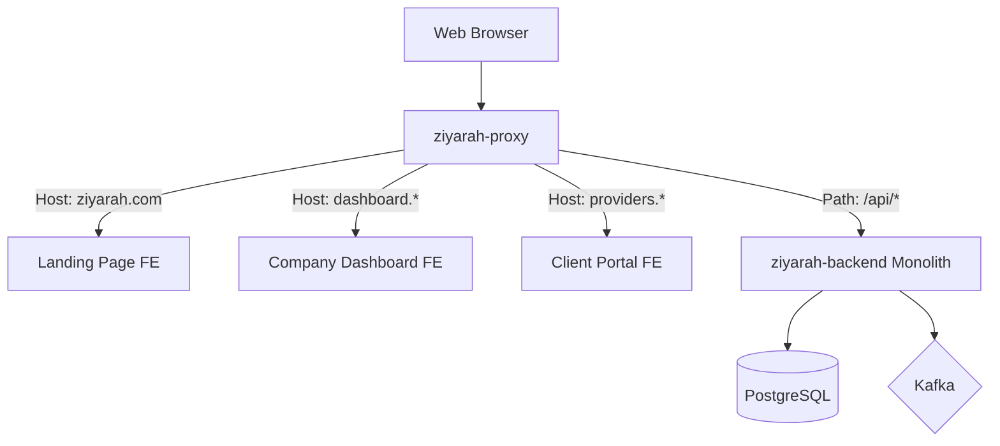

# Infrastructure & Frontend Architecture Report: Ziyarah Platform

This report details the containerization strategy and the frontend ecosystem for the Ziyarah "Pro" Modular Monolith.

## 1. Docker Containerization Strategy

The system is designed for **On-Premise Deployment** using Docker Compose to manage a suite of interconnected containers. This ensures environment parity and easy scaling of specific infrastructure components.

### 1.1 Container Networking & Storage Matrix

| Container Name | Internal Port | External Port | Volume / Mount Path | Purpose |
| :--- | :--- | :--- | :--- | :--- |
| **`ziyarah-backend`** | 8080 | 8080 | `/app/logs`, `/app/uploads` | Spring Boot Monolith |
| **`ziyarah-db`** | 5432 | 5432 | `/var/lib/postgresql/data` | PostgreSQL Persistence |
| **`ziyarah-cache`** | 6379 | 6379 | `/data` | Redis Cache |
| **`ziyarah-broker`** | 9092 | 9092 | `/var/lib/kafka/data` | Kafka Broker |
| **`ziyarah-proxy`** | 80, 443 | 80, 443 | `/etc/nginx/conf.d`, `/etc/letsencrypt` | Nginx Routing |
| **`frontend-core`** | 80 | 8081 | `/usr/share/nginx/html` | Landing & Dashboard SPA |
| **`frontend-portal`** | 80 | 8082 | `/usr/share/nginx/html` | Client Portal SPA |

---

## 2. Path & URL Mapping

The `ziyarah-proxy` orchestrates traffic across the container network based on hostnames and URL patterns.

| Hostname | External Port | Target Container | Root Path |
| :--- | :--- | :--- | :--- |
| `ziyarah.com` | 80/443 | `frontend-core` | `/` |
| `dashboard.*` | 80/443 | `frontend-core` | `/dashboard` |
| `providers.*` | 80/443 | `frontend-portal` | `/` |
| `api.ziyarah.com` | 80/443 | `ziyarah-backend` | `/api/v1` |

## 2. Frontend Landscape

The Ziyarah ecosystem comprises three distinct web interfaces, each tailored to a specific user segment.

### 2.1 Ziyarah Landing Page (`ziyarah.com`)
- **Technology**: React / Next.js (SSG/SSR for SEO).
- **Target**: End-users (Customers) and Service Providers.
- **Function**: 
    - **For Users**: Service discovery (Hotels, Taxis, etc.), featured offerings, and mobile app download links.
    - **For Providers**: Showcase of the Ziyarah ecosystem, provider onboarding/registration, and a public view of their services.
- **Routing**: Handled by `ziyarah-proxy` as the default root path.

### 2.2 Company Dashboard (`dashboard.ziyarah.com`)
- **Technology**: React SPA (Vite/CRA).
- **Target**: G1-G6 Staff (Admins, Managers, Sales, Finance, Support, HR).
- **Function**: Global system management, RBAC configuration, financial oversight, and complaint resolution.
- **Security**: Strict institutional login with granular feature visibility based on the `resource:action` matrix.

### 2.3 Client Portal (`providers.ziyarah.com`)
- **Technology**: React SPA (Vite/CRA).
- **Target**: G7 Service Providers (Hotels, Taxis, etc.).
- **Function**: Management of listings, staff, bookings, and earnings.
- **Isolation**: Automatically filters all backend queries by the `provider_id` tied to the provider's token.

---

## 3. Network & Routing Topology

`ziyarah-proxy` (Nginx) acts as the central traffic controller, routing requests based on the Host header.

---

## 4. Deployment Readiness

- **Volumes**: Persistent volumes are mapped for `ziyarah-db` and `ziyarah-broker` data to ensure durability.
- **Environment**: A central `.env` file managed via a Secrets Manager (or secure local file) configures all container secrets, API keys, and gateway credentials.
- **Health Checks**: Each container implements internal health checks (e.g., Spring Boot Actuator for the backend) to allow the proxy to manage traffic during updates.

---

## 5. Vite app build and deploy (Phase 5)

The canonical Company Dashboard and Client Portal are served from **`front/my-app`** (Vite). One build serves both:

- **Build:** From repo root, `cd front/my-app && npm ci && npm run build`. Output: `front/my-app/dist/` (static assets + `index.html`).
- **Dashboard:** Deploy `dist/` to `frontend-core`; nginx serves `/` and all routes (React Router handles `/dashboard`, `/management/*`, `/admin/*`, `/support/*`, etc.). Set `VITE_API_URL` at build time to the backend base URL (e.g. `https://api.ziyarah.com`).
- **Portal:** Same build; routes under `/portal` are handled by the same SPA. For host-based split (`providers.*` → portal), either (a) deploy the same build to `frontend-portal` with nginx `try_files` to `index.html` for `/portal` or (b) use a second build with base path `/portal` and deploy to `frontend-portal`.
- **Environment:** `VITE_API_URL` must point to the backend API root (e.g. `https://api.ziyarah.com` or `http://localhost:8080` for dev). No runtime env injection unless a small runtime config is loaded from a JSON or window global.

---
*Report generated by Antigravity.*
