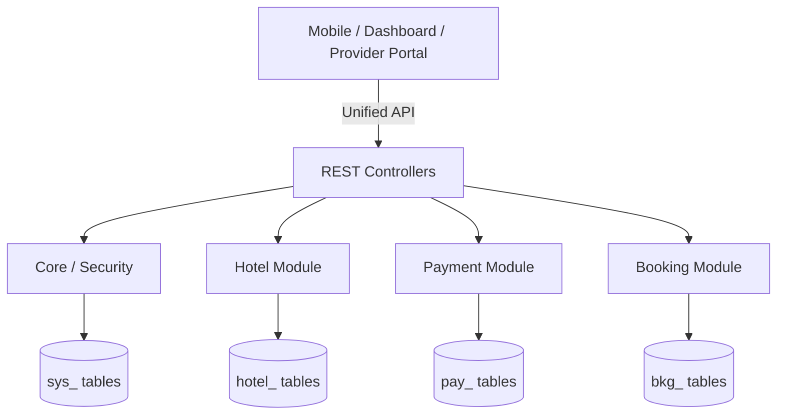

# System Evolution: Transition to Modular Monolith

## 1. Current System State

### Architecture & Key Components
Currently, the Ziyarah system is a **Standard Spring Boot Monolith** with shared database tables and direct service interactions. 
- **Database**: Single flat schema; high coupling between entities via foreign keys.
- **Modularity**: Unified codebase (Fat JAR) with partial package separation but frequent cross-cutting dependencies.

---

## 2. Summary of Implementation Strategy

### The Pivot: Domain-Driven Modular Monolith
The strategy shifts from a fragmented microservices model to a **highly structured Monolith** that mimics microservices' benefits without the infrastructure overhead.

**Key Upgrades**:
1.  **Strict Module Isolation**: Separation of business domains (Hotels, Taxis, Payments).
2.  **Database Independence**: Transition to table prefixes (e.g., `pay_`, `hotel_`) to prepare for future extraction.
3.  **Pro Features**: Advanced RBAC (7 Groups), Provider Portal, and Arabic i18n support.

---

## 3. Projected System State: The "Future-Ready" Monolith

### Evolution Architecture

### Improvements
- **Security**: Granular `resource:action` RBAC enforced at the module boundary.
- **Maintainability**: Changes in the `hotel` module cannot compile-break the `payment` module logic.
- **Scalability**: Modules are ready to be moved to physical microservices if traffic warrants, with minimal code refactoring.

---

## 4. Side-by-Side Comparison

| Feature | Current State | Modular Monolith (Future State) |
| :--- | :--- | :--- |
| **Logic Separation** | Package-level (Weak) | Module-level (Strict) |
| **Database** | Global Schema | Prefixed (Domain-Owned) |
| **Communication**| Direct Method Calls | Interface-only / Events |
| **RBAC** | Basic Roles | 50+ Permissions / Custom Roles |
| **Provider Portal**| None | Full React Dashboard |

---

## 5. Roadmap & Considerations

### Phases
1.  **Phase 1: Refactor Boundaries (Week 1-3)**: Move code to domain modules and define interfaces.
2.  **Phase 2: DB Prefix Migration (Week 4-6)**: Rename tables and update entity mappings.
3.  **Phase 3: Security & Features (Week 7-12)**: RBAC, Client Portal, and i18n.

### Open Questions
- **Transaction Management**: Since cross-module JOINs are prohibited, consistent multi-module updates will rely on **Domain Events** rather than standard database transactions.

---
*Strategic analysis by Antigravity.*
